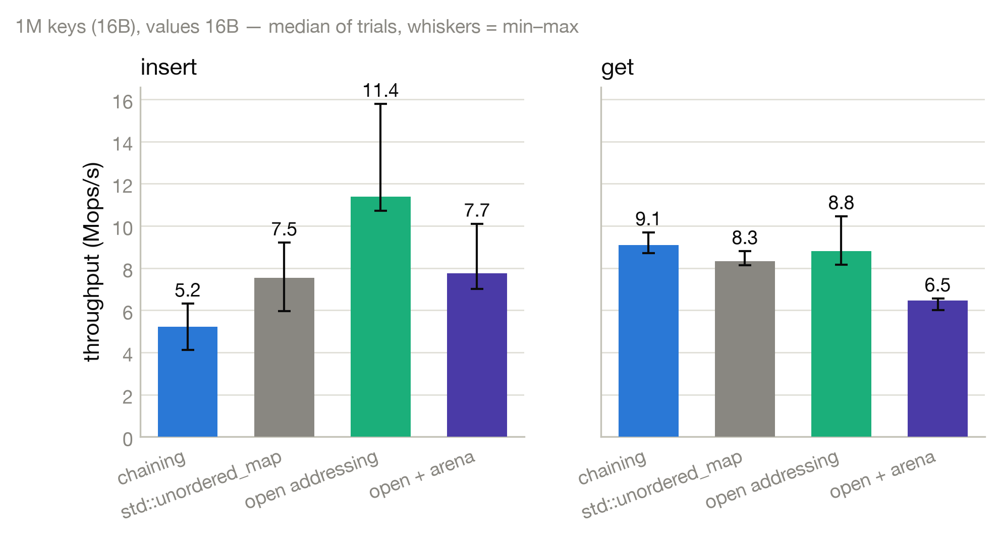
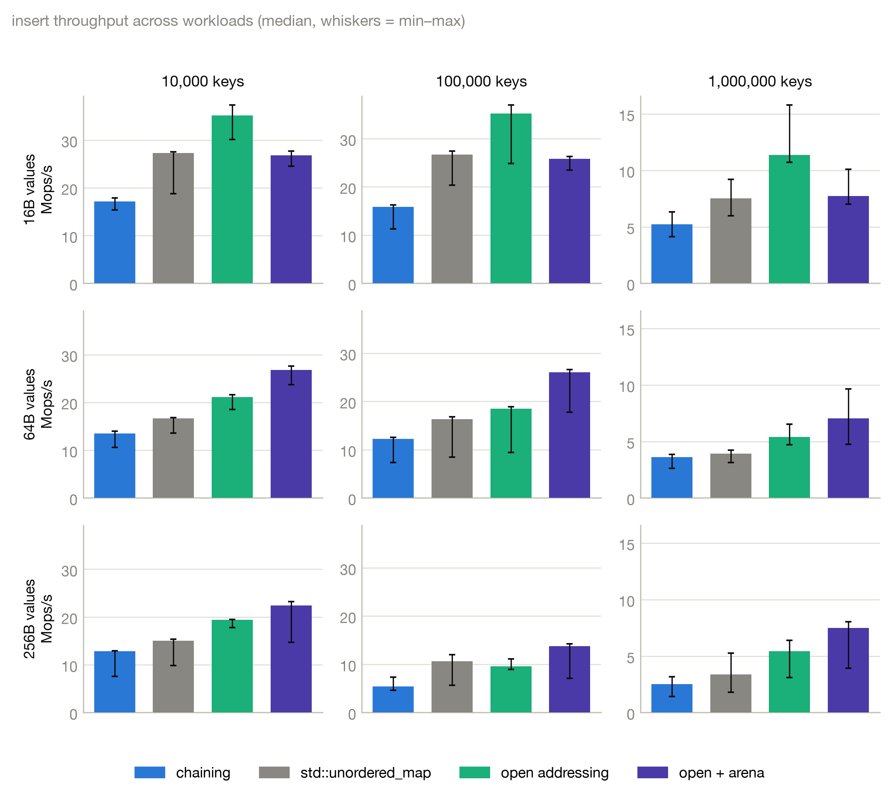
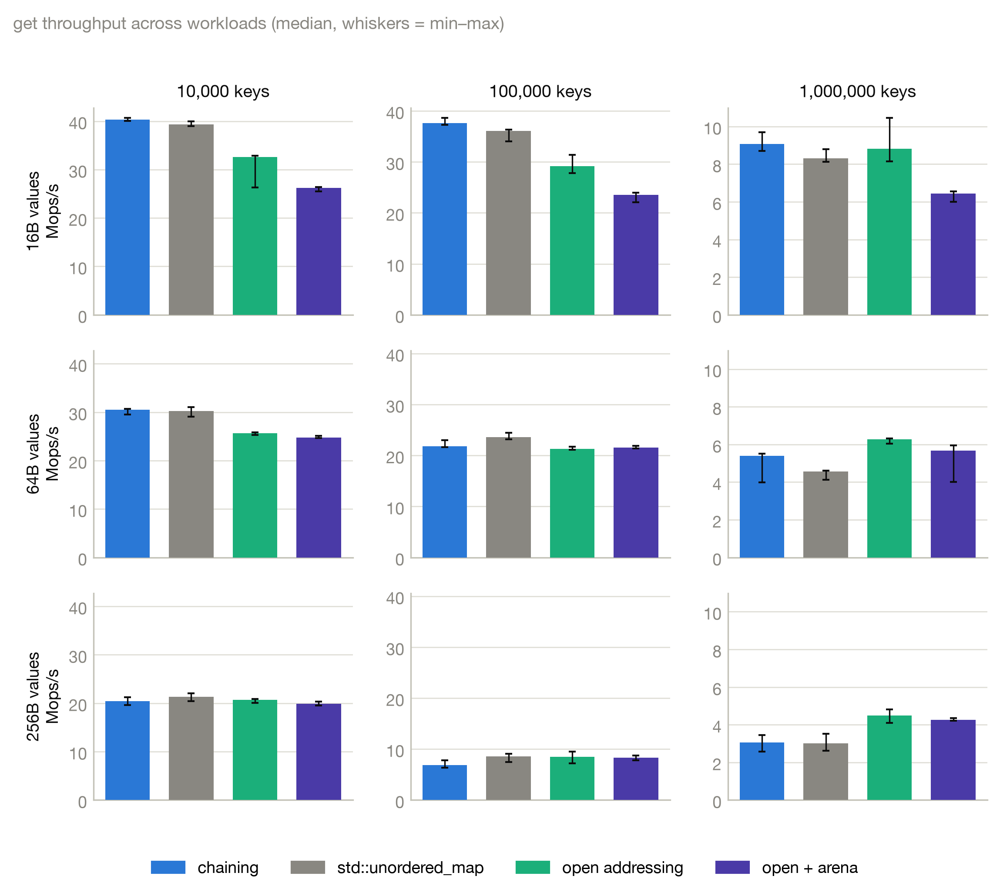
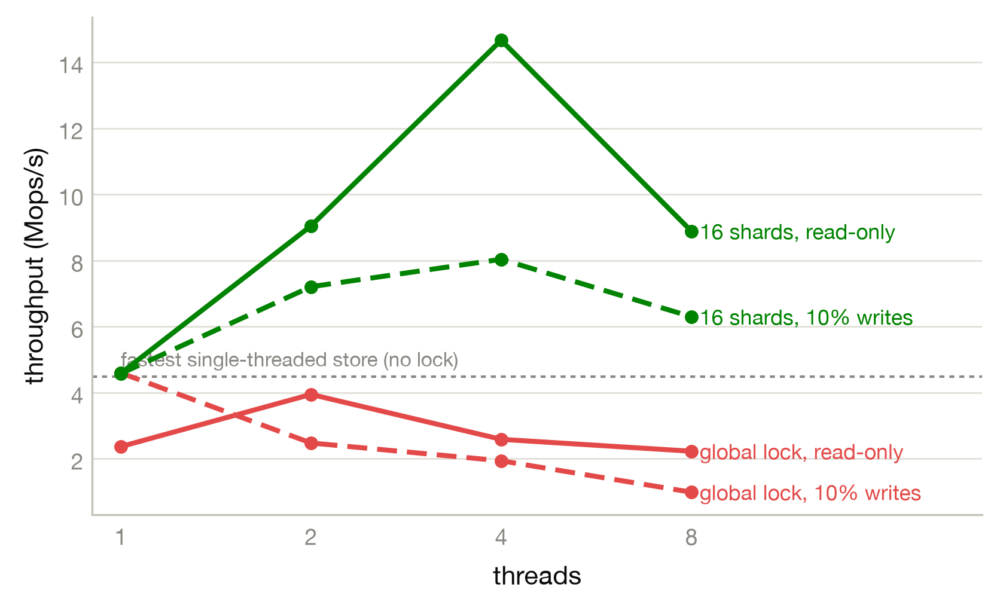
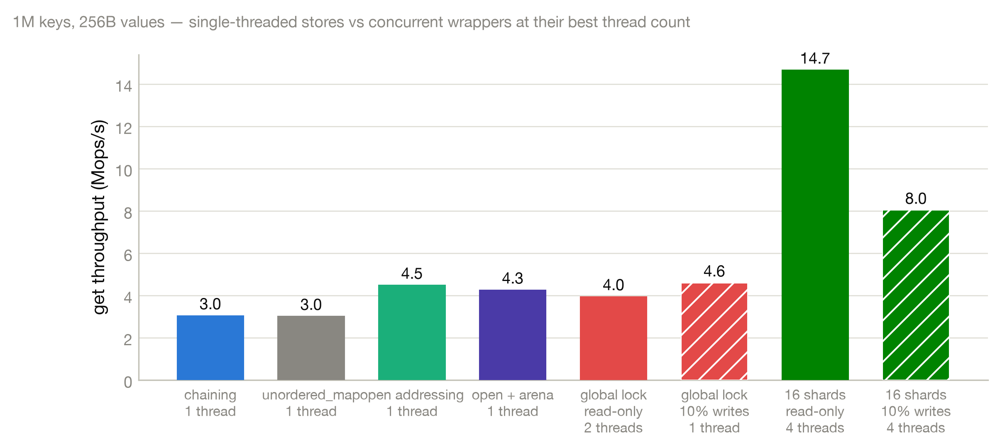
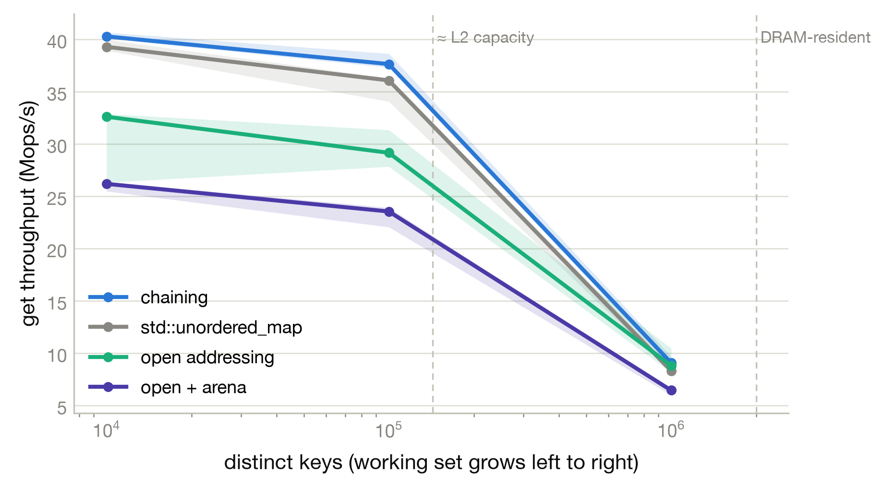
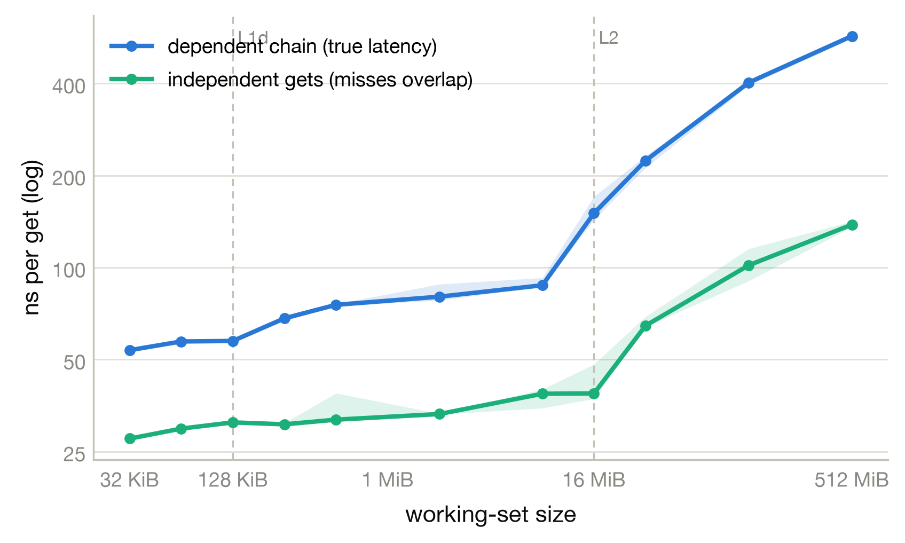

# FlashKV

A from-scratch, header-only hash table in modern C++20, built one measured decision at a time.

The project started from a question: **is it possible to improve hash-table performance by changing the in-memory implementation and adding concurrency?** Every step is a design change followed by a benchmark that either justifies it or doesn't, four table implementations and two concurrency strategies, each measured against `std::unordered_map` across key counts, value sizes, thread counts, and working-set size.

The sections below follow the order the work was done. Each is stated as a problem, a decision, and the measured result.

> All numbers measured on an **Apple M3** (4 performance + 4 efficiency cores), compiled with `-O2`, C++20.

---

## Part 1 — Baseline: separate chaining

**Design.** A textbook separately chained hash table: an array of buckets, each a `std::vector` of `{key, value}` entries, resized when the load factor crosses 0.75 ([`src/kv_store.hpp`](src/kv_store.hpp)).

**Method.** Before optimizing anything, the benchmark harness was built to produce numbers worth trusting:

- **Fixed seeds** for keys, values, and lookup order — every run uses identical data.
- **Median of 5 trials** per configuration, with min–max whiskers in every figure.
- **Self-checking**: each run asserts the exact number of expected hits and aborts on mismatch, so an incorrect store cannot report a fast number.
- **Setup excluded from timing**: all random data is materialized before any clock starts.

**Result.** Against `std::unordered_map`, chaining was competitive on lookups but slower on inserts. Since `std::unordered_map` is also node-based chaining, beating it meant changing the collision strategy.

## Part 2 — Open addressing: collisions resolved in contiguous memory

**Problem.** Chaining follows a pointer on every collision, and pointer indirection is where cache misses accumulate.

**Decision.** Switch to open addressing with linear probing: entries are stored directly in the slot array, collisions resolve by scanning to the next slot, and deletions leave a `Tombstone` so probe chains stay valid. Slots carry one of three states — `Empty`, `Occupied`, `Tombstone` ([`src/kv_store_open.hpp`](src/kv_store_open.hpp)). Probing walks contiguous memory instead of the heap.

**Result.** Open addressing produced the fastest inserts of any store measured — **up to 2.2× `std::unordered_map`** at 1M keys.



| Store (1M keys) | 16 B values | 64 B values | 256 B values |
|---|---|---|---|
| | insert / get (Mops/s) | insert / get | insert / get |
| chaining | 5.2 / 9.1 | 3.6 / 5.4 | 2.5 / 3.0 |
| `std::unordered_map` | 7.5 / 8.3 | 3.9 / 4.6 | 3.4 / 3.0 |
| **open addressing** | **11.4** / 8.8 | 5.4 / **6.3** | 5.4 / **4.5** |
| open + arena | 7.7 / 6.5 | 7.0 / 5.7 | 7.5 / 4.3 |

## Part 3 — Arena allocator: removing per-value allocations

**Problem.** Each slot still owned a `std::string`, so every value incurred a separate heap allocation. For low byte values this wasn't an issue due to SSO, in the 256 B column above, allocation cost grows.

**Decision.** Add a bump allocator ([`src/arena.hpp`](src/arena.hpp)): keys and values are copied into 64 KiB arena chunks, 8-byte aligned, and each slot holds a `{pointer, length}` reference instead of a string ([`src/kv_store_arena.hpp`](src/kv_store_arena.hpp)). One arena write replaces N individual allocations.

**Result.** A measurable trade-off: the arena is slower for 16 B values (the indirection isn't yet worthwhile) but the fastest inserter once values reach 64 B or more — 7.5 vs. open addressing's 5.4 Mops/s at 256 B. The full workload matrix locates each crossover:




## Part 4 — Concurrency, attempt one: a global lock

**Problem.** A single-threaded store is only half the design; it has to be safe and fast under concurrent access.

**Decision.** Wrap any store in a single `std::shared_mutex`, shared for reads, exclusive for writes ([`src/locked_store.hpp`](src/locked_store.hpp)). The wrapper is templated over the store type, so `KVStoreOpen` runs underneath unmodified.

**Result.** Across 1–8 threads, the global lock barely improved on single-threaded throughput, and under write contention it degraded as threads increased every thread serializes on the same lock. This established that lock granularity, not thread count, was the constraint.

## Part 5 — Concurrency, attempt two: sharded locking

**Decision.** Split the table into 16 independent shards, each with its own lock, routing a key to a shard by the high bits of its hash ([`src/sharded_store.hpp`](src/sharded_store.hpp)). Two details were required:

- **High** hash bits select the shard, because the low bits already select the slot within a shard; reusing the low bits would correlate the two.
- `alignas(128)` on each shard, so adjacent shards' locks never share a cache line

**Result.** Sharding scaled to the M3's 4 performance cores — **~3.6× on read-only 256 B** where the global lock flatlined.

| Config (1M keys, 256 B) | 1 thread | Peak |
|---|---|---|
| Global lock, read-only | 2.4 | 4.0 Mops/s @ 2T |
| **16 shards, read-only** | 4.6 | **14.7 Mops/s @ 4T** |
| 16 shards, 10% writes | 4.6 | 8.0 Mops/s @ 4T |




## Part 6 — Memory-hierarchy probe: locating the ceiling

**Problem.** Every result above is ultimately bounded by how far the data sits from the CPU. The final step measures that limit directly.

**Observation.** Get throughput collapses as the table outgrows L2 identical code and structure, a pure memory-system effect:



**Method.** Two access patterns isolate the two components of memory cost ([`benchmark/hierarchy.cpp`](benchmark/hierarchy.cpp)):

- A **dependent pointer chase** — each lookup's key is derived from the previous value, built into one cycle with [Sattolo's algorithm](https://en.wikipedia.org/wiki/Fisher%E2%80%93Yates_shuffle#Sattolo's_algorithm) so the CPU cannot overlap misses. This is true latency: ~54 ns in L1, rising to **~570 ns once the working set reaches DRAM**.
- **Independent gets**, where the out-of-order engine overlaps outstanding misses (memory-level parallelism). Cost per operation stays nearly flat until the working set exceeds L2.



The gap between the two curves quantifies why cache-friendly layout matters, and confirms the open-addressing and arena decisions.

---

## Store reference

All four stores share one interface (`set` / `get` / `del` / `size`) and grow automatically at a 0.75 load factor. The concurrency wrappers are templated over any of them.

| Store | Collision strategy | Value storage | Where it wins |
|---|---|---|---|
| `KVStore` | Separate chaining | `std::string` per entry | Simple baseline; competitive gets |
| `KVStoreOpen` | Open addressing, linear probing + tombstones | `std::string` per slot | Fastest inserts; cache-friendly |
| `KVStoreArena` | Open addressing | Packed into a bump [`Arena`](src/arena.hpp) | Large values — one allocation, not N |
| `LockedStore<S>` | wraps any store | — | Correctness under one global lock |
| `ShardedStore<S>` | wraps any store, 16 shards | — | Concurrent throughput |

## Build & run

Requires CMake ≥ 3.23 and a C++20 compiler. GoogleTest is fetched automatically.

```bash
cmake -B build
cmake --build build
```

```bash
# Correctness — typed tests across all three stores, built with AddressSanitizer
./build/Tests

# Benchmark: <value_len> <num_keys> [threads]
./build/Benchmark 64 1000000            # single-threaded, appends results.csv
./build/Benchmark 256 1000000 threads   # + thread scaling, appends results_threaded.csv

# Memory-hierarchy sweep
./build/Hierarchy                        # appends results_hierarchy.csv

# Full experiment matrix (~30–60 min): every store × key count × value size
./utils/run_matrix.sh
```

Regenerate every figure from the CSVs:

```bash
python3 -m venv .venv && source .venv/bin/activate
pip install pandas matplotlib
python utils/plot.py
```

## Repository layout

```
src/                     header-only stores
  kv_store.hpp             chaining
  kv_store_open.hpp        open addressing
  kv_store_arena.hpp       open addressing + arena
  arena.hpp                bump allocator
  locked_store.hpp         global-lock wrapper
  sharded_store.hpp        sharded-lock wrapper
benchmark/
  benchmark.cpp            single- & multi-threaded throughput
  hierarchy.cpp            latency vs. throughput across the cache hierarchy
tests/test.cpp             GoogleTest typed tests
utils/
  plot.py                  CSV → figures
  run_matrix.sh            full experiment sweep
data/                      committed benchmark CSVs
figures/                   committed plots (png + pdf)
```

## Summary of findings

| Step | Change | Measured outcome |
|---|---|---|
| 1 | Chaining baseline + harness | Competitive gets, slow inserts vs. `std::unordered_map` |
| 2 | Open addressing | Up to 2.2× faster inserts; cache-local probing |
| 3 | Arena allocator | Fastest inserts for values ≥ 64 B; slower for 16 B |
| 4 | Global lock | No scaling; degrades under contention |
| 5 | 16 sharded locks | ~3.6× throughput across 4 cores |
| 6 | Memory-hierarchy probe | Dependent-chase latency 54 ns (L1) → 570 ns (DRAM) |
